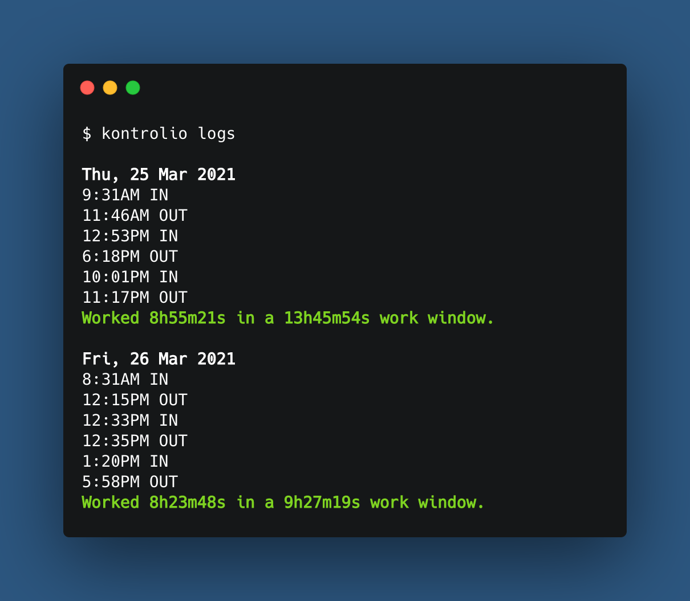

<p align="center">
  
  <h3 align="center">kontrolio-cli</h3>
  <p align="center">Kontrolio's CLI time clock, clock card machine, punch clock, or time recorder.</p>
</p>

---

<p align="center">
  
</p>

---

## Installation

- You can:
  - Install with homebrew if you're on a Mac or Linux:
    - `brew install marcelovicentegc/taps/kontrolio`
  - Install it with Node package managers for any platform:
    - `yarn global add @kontrolio/cli`
    - `npm i -g @kontrolio/cli`
  - [Or download the binaries for Linux (64 and 32 bit), macOS or Windows here](https://github.com/marcelovicentegc/kontrolio-cli/releases/latest)

See [Troubleshooting](#troubleshooting) if you have any issues on installation.

## Usage

```bash
$ kontrolio
```

```plain
NAME:
   kontrolio - Your cli time clock, clock card machine, punch clock or time recorder

USAGE:
   kontrolio [global options] command [command options] [arguments...]

VERSION:
   0.x

COMMANDS:
   config, c              Configure Kontrolio
   logs, l                Navigate through all your records
   punch, p               Punch your clock
   status, s              Check how many hours have you worked today
   help, h                Shows a list of commands or help for one command

GLOBAL OPTIONS:
   --help, -h     show help (default: false)
   --version, -v  print the version (default: false)
```

## Troubleshooting

In case you receive an `EACESS` error while trying to execute `kontrolio` after installing it with `npm` or `yarn`, change the file permissions with `chmod 755 <path_to_binaries>`.

## Development

Make sure you have a `.kontrolio.yaml` file under your home directory (`/home/marcelo` on Linux, `/Users/Marcelo` on macOs, `C:\Users\Marcelo` on Windows) with `dev` set to `true`, like this:

```yaml
dev: true
```

## [Changelog](https://github.com/marcelovicentegc/kontrolio/releases)
